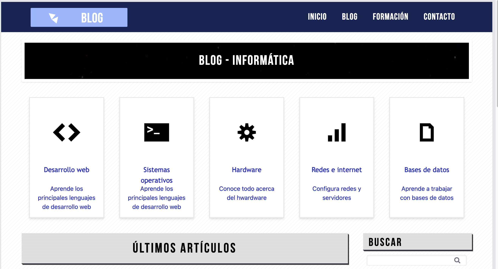
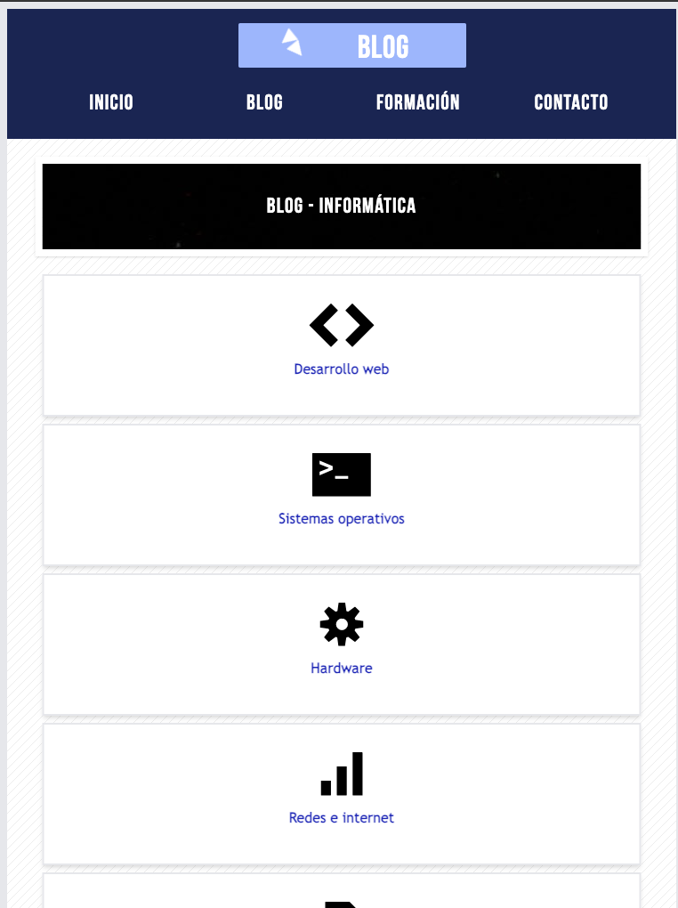

<h1 align="left">Blog informática</h1>

###

Web estática hecha con Astro y TailwindCSS. Responsiva para todos los dispositivos

###

    

###

    

###

<h2 align="left">Hecha con</h2>

###

    
    
    
    
    
    

###
